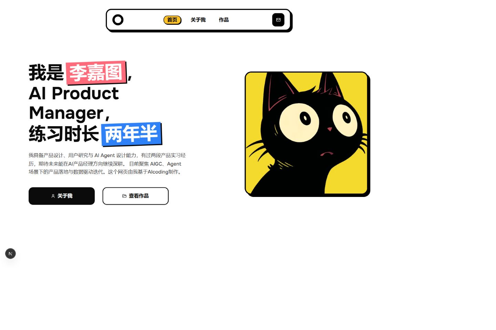

# 李嘉图 · AI个人网站

一个用 AI 辅助开发的个人网站，记录产品思考、近期生活与 AI 项目实践。采用黑色描边、明亮配色和贴纸卡片风格，支持桌面与手机浏览。



## 页面与交互

| 页面 | 内容 |
| --- | --- |
| 首页 `/` | 个人介绍、头像、关于我与作品入口 |
| 关于我 `/about` | 身份卡、能力介绍、轮播文字、近日生活、可展开的经历时间线 |
| 作品 `/portfolio` | 项目介绍、功能说明、演示图片与项目链接 |

近日生活卡片包含可点击的翻书插画、手柄反馈和悬停时流动的 AI 节点连线。卡片支持键盘操作，并适配系统动态效果偏好。

## 技术栈

- **Next.js 15.5.9**：App Router 与本地开发热更新。
- **React 19.1 + TypeScript**：页面组件与交互逻辑。
- **Tailwind CSS 4 + CSS Modules**：响应式布局与局部动画。
- **Lucide React + Radix UI**：图标与基础 UI 组件。

## 本地启动

准备 Node.js 与 npm，在项目目录运行：

```bash
npm ci --legacy-peer-deps
npm run dev
```

打开 [http://localhost:3000](http://localhost:3000)。保存源码后，开发预览会自动更新。

当前依赖包含与 React 19 的 peer dependency 声明不一致的旧组件，因此安装时使用 `--legacy-peer-deps`。仓库保留了两份包管理器锁文件，此处统一按 `package-lock.json` 和 npm 启动。

## 如果你想直接复制粘贴这个网站，你应该改哪些文件

| 想修改的内容 | 文件 |
| --- | --- |
| 首页姓名、自我介绍与头像 | [`components/hero-section.tsx`](components/hero-section.tsx) |
| 身份卡、能力介绍、近日生活内容与经历 | [`components/about-section.tsx`](components/about-section.tsx) |
| 生活卡片插画和点击交互 | [`components/recent-updates.tsx`](components/recent-updates.tsx) |
| 生活卡片颜色、间距和动画 | [`components/recent-updates.module.css`](components/recent-updates.module.css) |
| 作品名称、描述、图片和链接 | [`components/portfolio-section.tsx`](components/portfolio-section.tsx) |
| 导航菜单和邮件联系入口 | [`components/navigation.tsx`](components/navigation.tsx) |
| 浏览器标题、网站描述与字体 | [`app/layout.tsx`](app/layout.tsx) |
| 全局颜色与基础样式 | [`app/globals.css`](app/globals.css) |

`about-section.tsx` 中的三个数组对应不同区域：

- `slogans`：轮播文字。
- `recentUpdates`：最近在读、在玩、学习；修改 `title`、`content` 或 `href`。
- `gameProgress`：经历时间线；`full` 为点击展开后的详细内容。

图片放在 `public/` 中，在组件里使用 `/图片名.png` 引用。例如，首页与关于页共用 `/cat-avatar.png`。

当前联系邮箱与作品外链使用 `example.com` 示例地址。正式使用时，请分别修改导航、关于页的邮箱，以及作品数组中的 `href`。

## 项目结构

```text
app/                         路由、页面入口与全局样式
components/                  页面内容与交互组件
  ui/                        基础 UI 组件
lib/                         公共工具函数
public/                      网页可公开访问的图片和素材
docs/images/homepage.png     README 首页截图
```

## 检查与构建

```bash
# TypeScript 检查
npx tsc --noEmit --incremental false

# 生产构建
npm run build

# 启动生产版本（先完成构建）
npm run start
```

构建会通过 `next/font/google` 获取字体，需要可用的网络连接。当前 Next.js 配置会跳过构建时的 TypeScript 和 ESLint 检查，请单独运行上面的类型检查。`lint` 脚本尚缺少 ESLint 依赖与配置，需要补齐后使用。

## 部署

在支持 Next.js 的托管平台导入仓库，安装命令设为 `npm ci --legacy-peer-deps`，构建命令设为 `npm run build`。自托管时，构建后运行 `npm run start`。

首页截图保存在 `docs/images/`，更换首页设计后可更新同名图片，README 会使用新的截图。

